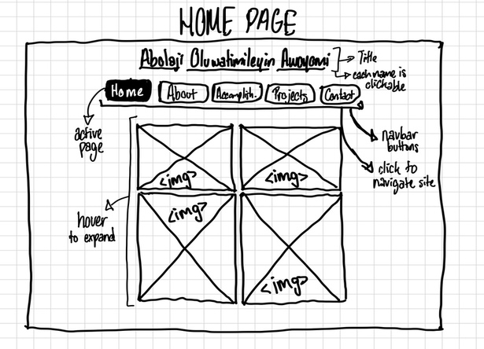
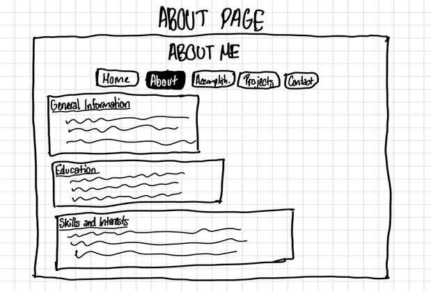
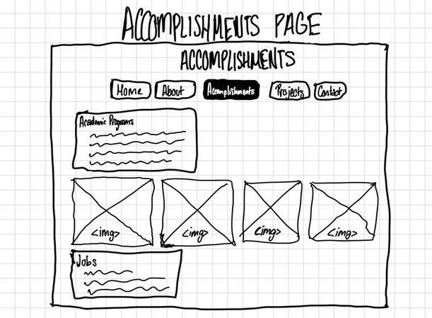
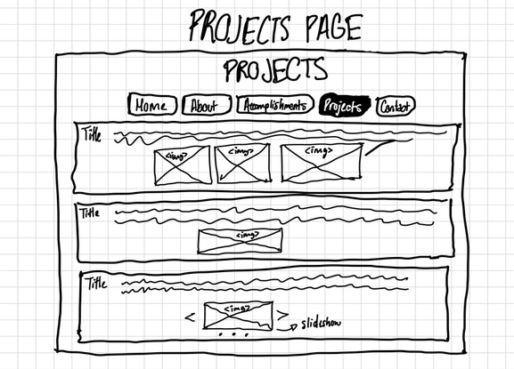
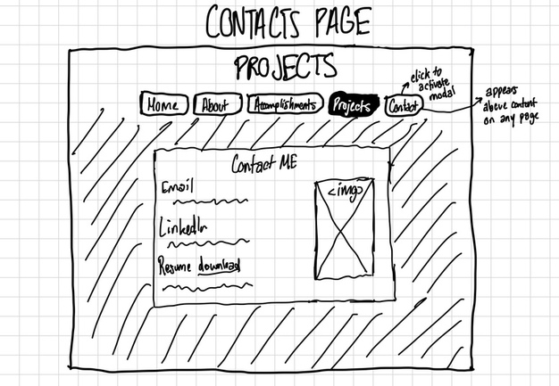

# Project 1, Milestone 1: Design Journey

[← Table of Contents](design-journey.md)

**Replace ALL _TODOs_ with your work.** (There should be no TODOs in the final submission.)

Be clear and concise in your writing. Bullets points are encouraged.

Place all design journey images inside the "design-plan" folder and then link them in Markdown so that they are visible in Markdown Preview.

**Everything, including images, must be visible in _Markdown: Open Preview_.** If it's not visible in the Markdown preview, then we can't grade it. We also can't give you partial credit either. **Please make sure your design journey should is easy to read for the grader;** in Markdown preview the question _and_ answer should have a blank line between them.

## Existing Design

**Make the case for your decisions using concepts from class, as well as other design principles, theories, examples, and cases from outside of class (includes the design prerequisite for this course).**

You can use bullet points and lists, or full paragraphs, or a combo, whichever is appropriate. The writing should be solid draft quality.

### Existing Site: The Site
> What is your existing site about? Tell us about it. (1 sentence)
This site is essentially all about me and things I've done in my life. Outside of the standard 'About Me', I want to add some of my accomplishments regarding school/athletics/etc and some projects that I've worked on for fun. In other words, this could be a more casual digital porfolio/resume of sorts.

> How and where did you create this site? (1 sentence)

I created this site when I took INFO 1300. Created with HTML, CSS, and JS.

> Is this site designed for desktop, mobile devices or both? (1 sentence)

Desktop

> Explain why this website is a **static** website. (1 sentence)

This is a static website because it does not have any functionings that will alter the code of the website.

### Existing Site: Audience
> Briefly explain your site's audience.
> Be specific and justify why this audience is a **cohesive** group. (1-2 sentences)

My intended audience is people who want to get to know me. This includes but is not limited to those who know me but also those who don't know e in real life. This audience will mostly be people my age and perhaps older because those are the people I engage with most in life at this moment.

### Existing Site: Audience Goals
> Document your existing site's audience's goals. (These should be informed by user research. Not assumptions or stereotypes.)
> List each goal below. There is no specific number of goals required for this, but you need enough to do the job (Hint: It's more than 1 and probably more than 2).

1. Look at what projects I've created

2. See what I have accomplished(awards/programs)

3. Learn more about how I got to where I am in life

4. Get in contact with me to connect/talk

### Existing Site: Design/Sketches
> Sketch each page of your existing site.
> **You may not copy your sketches from a previous assignment.**
> Why can't you copy the sketches? I want to get you thinking about the strengths/weaknesses of your current design.
> Provide a **1 sentence** description _underneath_ each sketch that describes the page.

This page is the home page briefly introducing myself to the user with images from different stages in my life.

This page is the about page that has background/general textual information about myself from education to skills.

This page is the accomplishments page that showcases my acccomplishments(programs, jobs, etc). It has both text sections and some images.

This page is the projects page that has pictures and text descriptions of some of the projects that I've created and worked on.

This page is the contact page that was designed as a pop-up modal with an image and some text that provides my contact methods to the user.

[← Table of Contents](design-journey.md)
