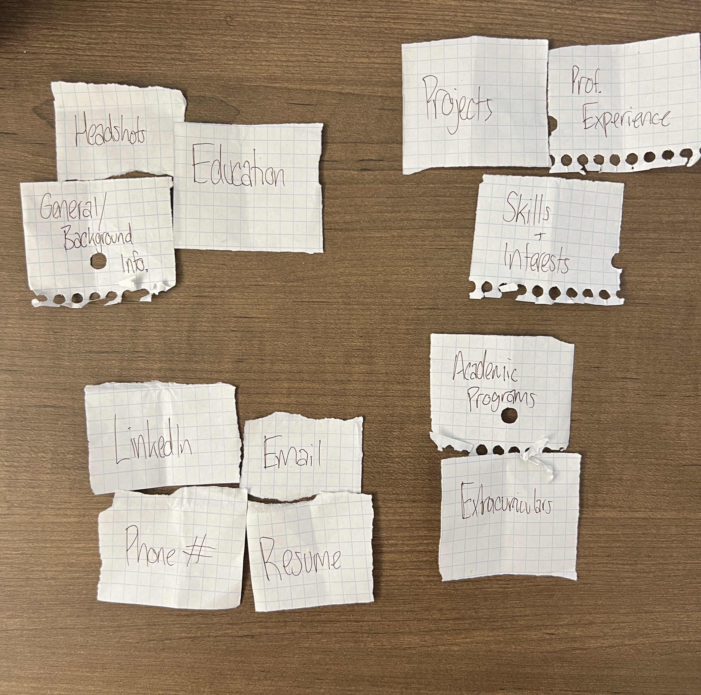

# Project 1, Milestone 2: Design Journey

[← Table of Contents](design-journey.md)

**Replace ALL _TODOs_ with your work.** (There should be no TODOs in the final submission.)

Be clear and concise in your writing. Bullets points are encouraged.

Place all design journey images inside the "design-plan" folder and then link them in Markdown so that they are visible in Markdown Preview.

**Everything, including images, must be visible in _Markdown: Open Preview_.** If it's not visible in the Markdown preview, then we can't grade it. We also can't give you partial credit either. **Please make sure your design journey should is easy to read for the grader;** in Markdown preview the question _and_ answer should have a blank line between them.

## Milestone 1 Feedback Revisions
> Explain what you revised in response to the Milestone 1 feedback (1-3 sentences)

N/A

## Refined Design

### Refined Design: Persona
> Use the goals you identified and your prior user research to develop a persona of your site's audience.
> Your persona must have a name and a face. The face can be a photo of a face or a drawing, etc.
> You may type out the persona below with bullet points or include an image of the persona. Just make sure it's easy to read the persona when previewing markdown.

Persona's Name: Emily Parker

Age: 29 years old
Occupation: Hiring Manager
Location: New York City, NY
Bio:
    - 29-year-old hiring manager based in New York
    - Does her work mostly from a Macbook Pro
    - Has a keen eye for talent and a passion for connecting with professionals
    - Specializes in recruiting brilliant individuals across different industries
    - Seeks to find new interns/employees
    - Used to work as a graphic designer/web developer
      - Enjoys exploring visually appealing websites that are easy to navigate
      - Appreciates design that reflects individuality
      - Values creativity and uniqueness
    - Every project tells a story!

### Refined Design: Narrow or Wide
> Will your refined design be functional on narrow or wide device? (a few words)

This design will be functional on wide devices.

### Refined Design: Form Brainstorm
> Brainstorm ideas for collecting data from your persona on your website.
> The form must support the persona's goals when using the website.
> For each form idea, explain how the form supports the goals of the persona. (1 sentence per idea)
> **Refer to the persona by name.**

1. Contact Form - Emily could fill it out to reach out to me/use my sources of contact
2. Rating/Review Form - Emily can take a look at some of my projects and leave comments/critiques on them
3. Inquiry Form - Emily can use the inquiry form to ask for additional information about content she comes across on the site.

### Refined Design: Content
> List **all** the content you plan to include your website for your **persona**.
> You should list all types of content you planned to include (i.e. text, photos, images, etc.)
> List the content here. Label the content as "(new)" if it's new to the existing site.
> **Do not include the content here, just provide a list summarizing the content.**

- Text
  - General Information
  - Education Background
  - Skills and Interests
  - Academic Programs
  - Extracurriculars
  - Achievements
  - Professional Experience
  - Project descriptions
  - Contact Information

- Images
  - Project photos/walkthroughs
  - Headshots
  - Program images

- Additional
  - Slideshow
  - Modal
  - Form(new)

### Refined Design: Content Justification
> Explain why this content supports the goals of your persona. (1-2 sentences)
> **Refer to the persona by name.**

I believe that this content altogether supports Emily's goals because she has the opportunity
to see all public aspects of my life both professionally and socially. She can get to know my personality
through my projects while also learning about my background as a student and person.

### Refined Design: Content Organization
> Organize the content for the audience and identify possible pages for the content using **several iterations** of card sorting.
> Include photographic evidence of each iteration of card sorting **and** an explanation of your thought process for each iteration. (1 sentence per iteration)
> **Please physically sort cards;** please don't try and do this digitally.
> **Refer to the persona by name.**

This iteration would have 3 pages that could be a home page(headshots, linkedin, email, etc),
an about page(education, gen. info, academics), and a professional page(prof. experience, projects, etc)

This iteration would have 4 pages(Home, Academics, Work, Contact).

### Refined Design: Navigation
> Please list the pages you will include in your website's navigation.

- Home
- Academics
- Work
- Contact

> Explain why the names of these pages make sense for your persona. (1 sentence)

These names will make sense to Emily because they are tradtionally recognizable and convey the content that will be displayed on the page

### Refined Design: Design
> Refine the design of your site to address the goals of your persona.
> Include iterations of **sketches** for each page of the refined design.
> Provide a brief explanation _underneath_ each sketch. (1 sentence per sketch)
> **Refer to your persona by name in each explanation.**

This design will have a headshot with general information and education.

This design will have my academic programs and extracurriculars with text and images.

This design will show off my projects with pictures and descriptions and also professional experience and my skills and interests.

This design will have a contact form and also list my contact information.

### Partial Plan
> Using your refined sketches, plan your site's partials.
> You may describe each partial or sketch it. It's up to you!
> Explain how you will customize at least 1 partial. (1 sentence)

1. The first partial will be for the navigation bar. It will use php variables that will change the active class of the page.
2. I also plan to use a partial for the footer that will be displayed on all pages as well.

[← Table of Contents](design-journey.md)
