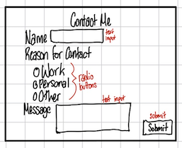
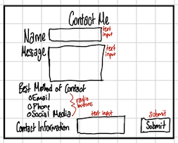
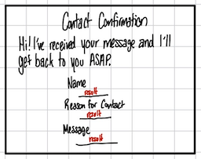
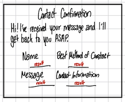

# Project 1, Milestone 3: Design Journey

[← Table of Contents](design-journey.md)

**Replace ALL _TODOs_ with your work.** (There should be no TODOs in the final submission.)

Be clear and concise in your writing. Bullets points are encouraged.

Place all design journey images inside the "design-plan" folder and then link them in Markdown so that they are visible in Markdown Preview.

**Everything, including images, must be visible in _Markdown: Open Preview_.** If it's not visible in the Markdown preview, then we can't grade it. We also can't give you partial credit either. **Please make sure your design journey should is easy to read for the grader;** in Markdown preview the question _and_ answer should have a blank line between them.

## Milestone 2 Feedback Revisions
> Explain what you revised in response to the Milestone 2 feedback (1-2 sentences)

I couldn’t make any revisions because my slip day submission for p1m2 wasn’t graded and the feedback wasn't sent back to me yet

## Form Design and Plannning

### Form Purpose & Persona Goals
> Explain your form's purpose and how it supports the goals of your persona. (1-2 sentences)

I was planning on using my form as a contact form to provide Emily with an opportunity to get in contact with me. The form will have different questions to help Emily write what she would like to say in her preferred mode of contact.

### Form Design
> Design your site's form.
> Include iterations of sketches of the form.
> Provide a brief explanation underneath each sketch. (1 sentences for each sketch)

This iteration has 3 form controls(text input, radio buttons, and a submit button). The form asks for the user’s name, their reason for contact, and the content of the message itself.

This iteration has 3 form controls(text input, radio buttons, and a submit button). The form asks for the user’s name, their message, their best method of contact,and a space to provide the specific link/information

### Form Confirmation
> Design your site's form confirmation page.
> Include iterations of sketches of the form.
> Provide a brief explanation underneath each sketch. (1 sentences for each sketch)

This confirmation has a confirmation message to confirm receipt of all data and also displays the data entered by the user(name, reason for contact, and the message)

This confirmation has a confirmation message to confirm receipt of all data and also displays the data entered by the user(name, message, best method of contact, and the contact information

### Form Planning
> Will your form use a GET or POST request?
> Justify your decision as to why the request type is appropriate for the form. (1 sentence)

My form will use a POST request because the user won't be requesting any data from the server but solely sending data to me.

[← Table of Contents](design-journey.md)
